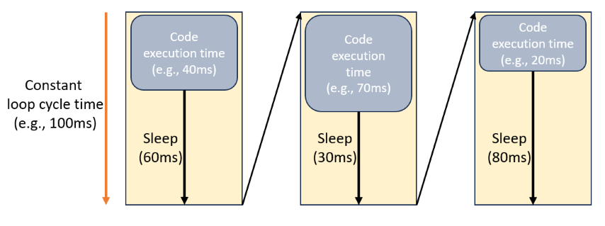

# Simple-Rate
A simple ROS Rate implementation with pure Python. The ```Rate``` class provides a convenient way to control the rate at which a process loops and sleeps based on a specified frequency.

    

## Usage
### Importing the Class
```python
from rate import Rate
```    
    
## Initialization
```python
rate = Rate(hz)
```    
* Parameters:
    * hz (int): Frequency in hertz (cycles per second) at which to perform actions.

## Methods
```remaining()```
```python
remaining_time = rate.remaining()
```    
* Returns the time remaining until the next iteration should occur based on the specified rate.
    
```sleep()```
```python
rate.sleep()
```    
* Executes a sleep operation to maintain the specified rate. Adjusts dynamically to account for time elapsed since the last iteration.
    
## Customization
You can customize the behavior of the ```Rate``` class by providing alternative time functions and sleep functions during initialization:
```python
rate = Rate(hz, timefun=my_custom_time_function, sleepfun=my_custom_sleep_function)
```   
    
## Example USage
```python
from rate import Rate
import time

rate = Rate(10)  # Executes at 10 Hz

while True:
    # Perform actions at the desired rate
    # ...

    # Sleep to maintain the rate
    rate.sleep()
```